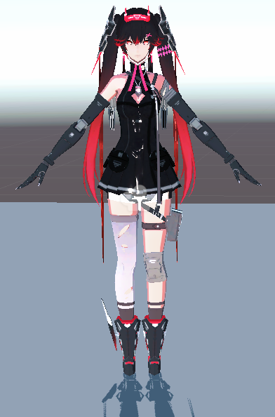

# Character Lighting

## 概要
在NPR渲染中，我们常常需要为每个角色提供自己的光照方向、颜色与阴影。借助Unity UniversalRP，我们制作了一套通用Character Lighting方案。资源位于[渲染中台工作仓库](https://gitlab-sh.funplus.io/client_engine/RendererDemo)中**NPRDemo01**。
如下：**Character Lighting OFF** V.S. **Character Lighting ON**

## 使用流程（面向项目)
### 1. 配置 Universal RP 
* 参考**NPRDemo01/Settings/NprDemo01.asset**（URP Asset）去配置**Shadow Renderer**
 

 
 
 上图配置表明，在ShadowRenderer阶段，只绘制标记为**Character**的物体，使用ShadowEncoder重载，生成ShadowMap
### 2. 创建RenderTexture
* 创建合适大小的RenderTexture。此处之所以Color Format为**RGBA8**，是因为UniversalRP原生不支持depth only的RT作为shader的输入。因此，我们需要将模型的32f深度，编码为RGBA8。

### 3. 配置Camera
* 在场景中创建Camera，可以考虑绑定到角色节点上。
 
* 修改投影方式为正交。远近切面按照需求配置。选择Renderer为第一步配置好的**Shadow Renderer**。
* 将背景色调整为黑色，指定渲染目标为第二步创建好的Render Texture
 
* 挂载脚本**CharacterLight.cs**。在脚本中指定角色光的颜色、强度和受光物体。其中光照方向即为摄像机的注视方向。

## 实现要点（面向中台）
在材质的实现上，我们利用了Amplify Shader Editor的模板功能。需要使用该Character Light功能的材质模板，需要在模板中配置Shader Feature  **_CHARACTER_LIGHT_ENABLE**：

根据该feature调整光照获取的代码可以在NPRLighting.hlsl中查阅：

## To do
* 优化Universal RP，让其支持Depth Target直接作为Material Input。
* 去除Character Shadow的Color Target
* 优化脚本，考虑自动创建Render Texture和进一步自动化配置