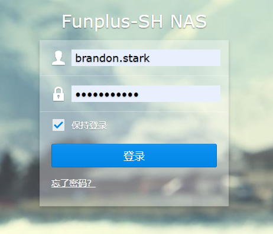
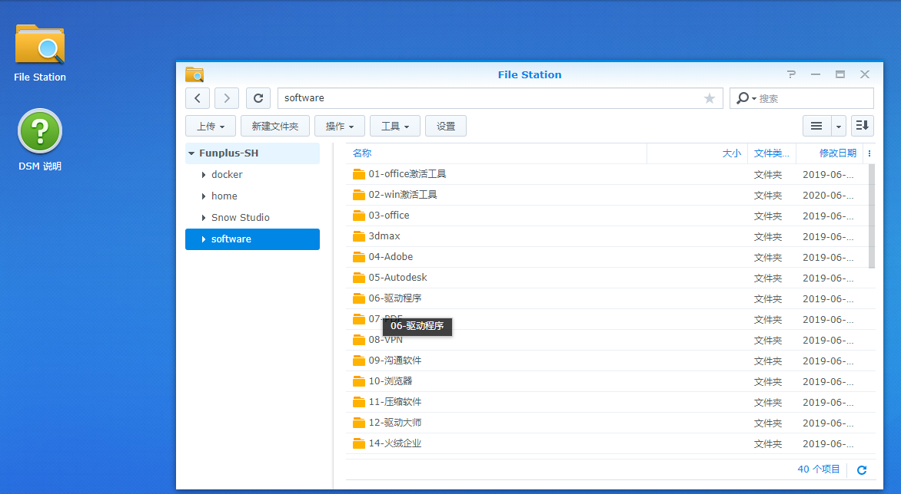
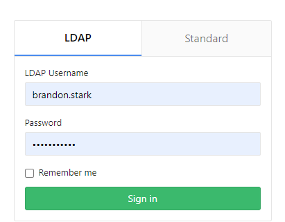

# FunPlus 客户端新人入职指南

欢迎新同学加入Funplus客户端中台~以下是我们为新来的小伙伴提供的新员工入职指南。

## 1. 工作环境配置

​	**Unity**: 209.4.0(LTS)

​	**Visual Studio Professinal 2019**: https://visualstudio.microsoft.com/zh-hans/vs/

​	**脚本工具**(建议)：https://code.visualstudio.com/

## 2. 常用软件

浏览器输入http://10.1.32.100:5000/进入公司NAS，使用公司邮箱用户名前缀与密码登录：

在**FileStation->Software**中，有很多常用软件

## 3. gitlab

* 使用邮箱前缀和密码登录https://gitlab-sh.funplus.io/

* 在Profile->SSH Keys中创建自己的 key。联系相关项目负责人加入到对应项目
* 渲染中台仓库:https://gitlab-sh.funplus.io/client_engine/RendererDemo

## 4. 项目地址

* **Phoenix**:
* **Snow**:

## 5. 知识分享