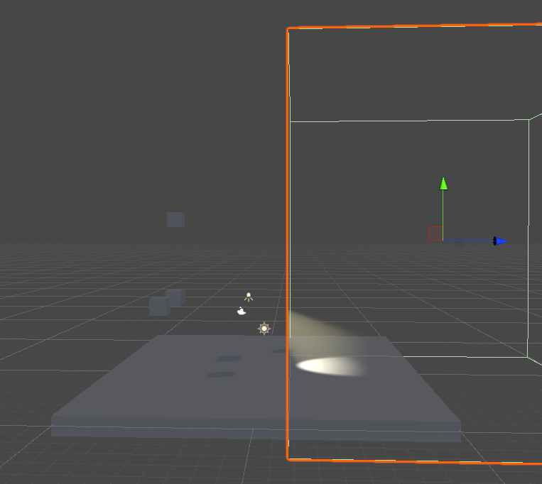

## Volume Lighting in Unity

---

## 前言

对于Volumetric Lighting / Fog的实现，已经有很多的文章，Unreal也提供直接的体积光/体积雾生成器。Unity Asset Store上也有一些实现的插件，但是基本都是利用可解析模型，效果较差。

我们希望有：

* 高质量的Spot Light Volumetric Light 表现

* Shadow Volumetric

* 自定义密度分布函数（噪声生成器）

* 与场景中light表现匹配

* 高效实现方式

  

---

## 实现细节

### Ray Tracing

我们从摄像机发射出一条射线，在体积光的迭代范围内采样，将加和后的结果作为最终颜色显示。

### Volumetric Bound

我们用一个box去规定Volumetric Light的绘制范围。只有box内部才能有灯光的体积效果。

体积光的效果，其实是对整个Cube的一次绘制，以blend add的混合模式，叠加到场景中。需要注意的是，我们绘制的是这个cube的Back Face.

### Frustum Plane Extraction

为了能让每一次采样都在有效范围内，显而易见，应当将采样的范围限制在Spot Light的光锥范围内。

这里有几种做法，如将光锥当作mesh进行绘制得到深度，通过深度采样得到结果。

我们这里采用另外一种方法：直接使用射线与光视锥平面求交。我们将SpotLight的Frustum传入shader，在shader中进行Ray/Plane Intersection

### Sampling

我们并不追求完全物理正确的散射灯光（算法较为复杂，需要从灯光位置到采样点位置进行再积分），所以直接使用Spot Light的Unity默认计算方法来作为该点的散射结果。每个采样结果乘以采样间距再进行加和，得到一个简单的积分模拟。

### 非均匀介质

待定

### Shadow

Spot Light Shadow

## 参考

https://zhuanlan.zhihu.com/p/124297905

https://www.youtube.com/watch?v=RdN06E6Xn9E